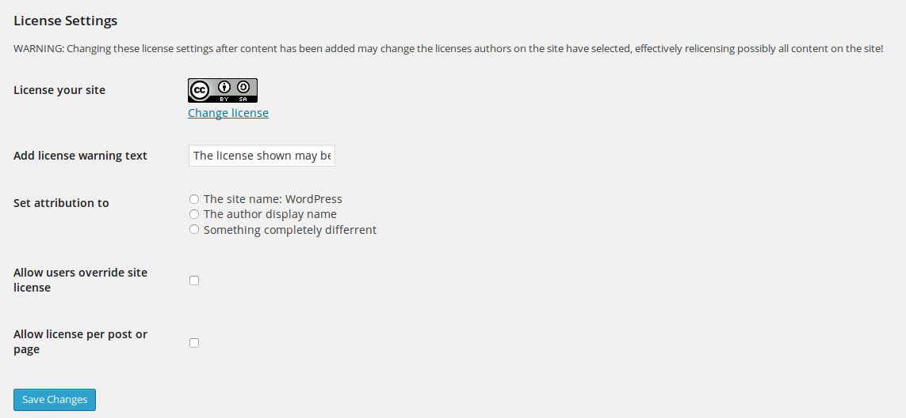
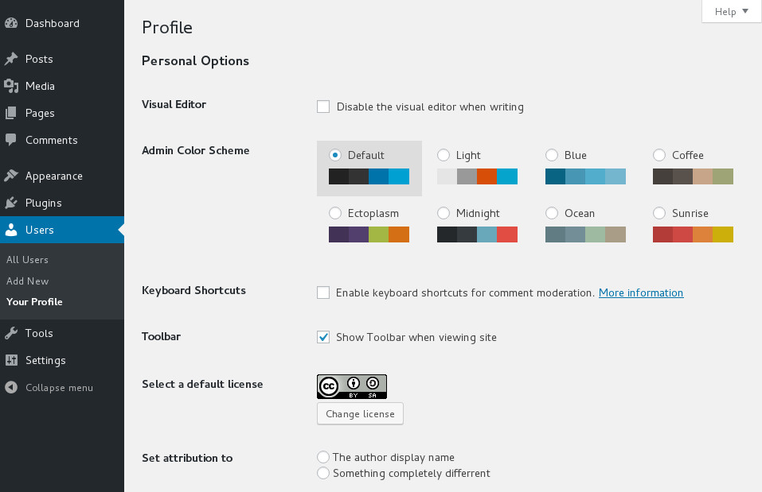
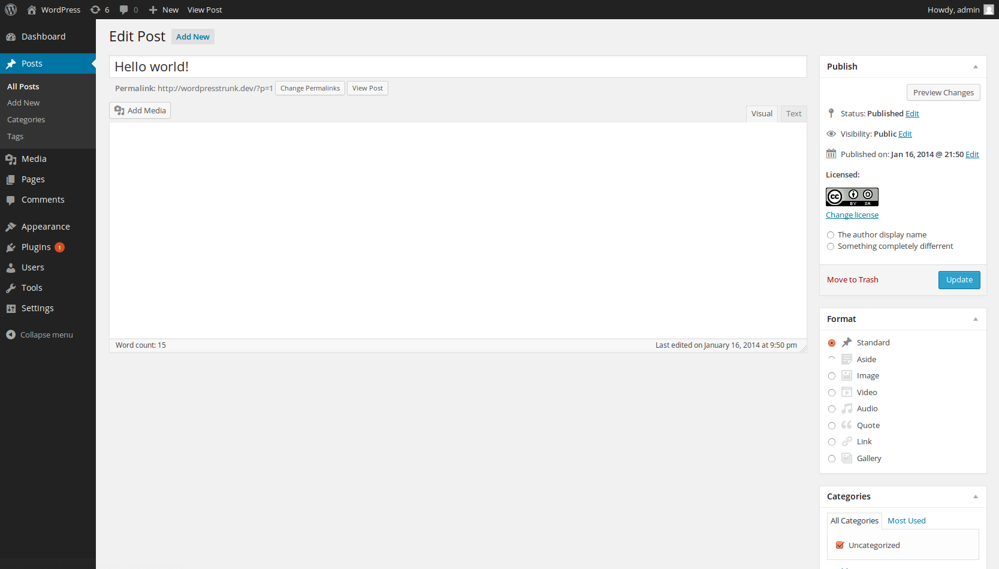
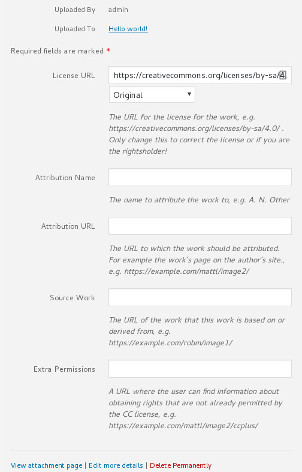
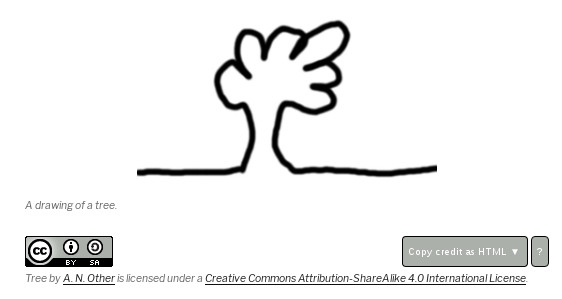
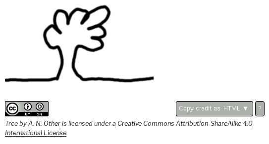

# Creative Commons plugin for WordPress

This is a WordPress plugin to assist you in choosing and displaying a Creative Commons license for your blog or website.

## Credits

Main development work by:

* Tarmo Toikkanen
* Bjorn Wijers

On behalf of Creative Commons:

* Matt Lee
* Rob Myers

## Contribute

Feel free to help us make the plugin more stable by testing the plugin and reporting bugs. Send any feedback using [Github's issue tracker](https://github.com/creativecommons/creativecommons-wordpress-plugin/issues/new), or send an email to hackers@creativecommons.org

Download the latest version:
[release-2.1b](https://github.com/creativecommons/creativecommons-wordpress-plugin/releases/tag/release-2.1b)

## Features

The plugin allows you to license WordPress content such as posts and pages as well as image files. You can:

- License your blog (single WordPress install)
- License your WordPress Network (WordPress Multisite install)
- License some of your sites differently in your WordPress Network
- License all your content with the same license (license per author)
- License some posts, pages or images differently from your default license (per content license)
- Prevent license changes in your WordPress Network (all pages on all sites need to use the same license)
- Prevent license changes per site (all pages on a site must use the same license)
- Display license for the site, posts and pages.
- Display license information with "One Click Attribution" for images

*Possible future features*

Here's a list of some features we'd love to add to this plugin or support in a separate (child) plugin. If you'd like these or other features to be implemented you may consider supporting this plugin with code contributions, testing or funding Creative Commons for further development.

- Allow more kinds of media files to be licensed
- Extract license information from more kinds of media files
- Allow to search (using external search engines) for specific Creative Commons licensed media files

## Installation

1. Upload the "creativecommons-wordpress-plugin" folder to the "/wp-content/plugins/" directory
2. Activate the plugin through the "Plugins" menu in WordPress
3. From the Widgets menu, drag the License widget to the widget area in which you would like the license to appear.  Otherwise, the license for each page or post will appear in the Wordpress footer area by default.

## Usage

The default license used by the plugin is the Creative Commons [Attribution-ShareAlike (CC BY-SA)](http://creativecommons.org/licenses/by-sa/4.0/) license.
This can be easily changed, including attribution, depending on the permissions by a user with the role: superadmin, site admin or author.

### Choose A Site License

To choose a site-wide license, go to the "Creative Commons" option in the "Settings" item on the left hand menu in the WordPress admin site.

Be careful when changing these options, they may affect existing published work.

### Choose An Author License

When changing an individual author's license is enabled, the option to do so is included on the Users Profile page for that author.

You can change the license ("Select a default license") or the attribution ("Set attribution to").

### Choose A Post Or Page License

If changing the license on individual posts and pages is enabled, the option to do so is included in the editor on the right hand side of the page under the heading "Licensed:".

You can change the license or the attribution.

Remember to save the post or page after you change its license.

### Choose An Image License

In the "Attachment Details" page for an image in the Media Library, there are fields to edit license and attribution information underneath the usual Title, Caption and other fields for the image.

Images that support Exif data may include licensing metadata. Where possible the plugin extracts that metadata and uses it to pre-populate the license information fields.

### Display An Image License

If you place a [caption] block around an image that has licensing metadata and include the attachement ID, that will display the license block with the caption. e.g.:

    [caption id="attachment_10" width="300"] A caption. [/caption]

Otherwise if you place a [license] block around an image that has licensing metadata, that will display the license block alone:

    [license][/license]

## History

This plugin is loosely based on an existing, but seemingly abandoned WordPress plugin named 'License' (a component of the [MIT Educational Collaboration Space](http://ecs.mit.edu) project) by mitcho (Michael Yoshitaka Erlewine) & Brett Mellor. We're also inspired by Creative Commons' original WPLicense plugin written by former Creative Commons CTO Nathan Yergler.

## Development

If you're interested in the code have a look at the master branch for releases. Development will be done in the development branch.

Occasionally other branches may be available to test new features or play with new ideas, but they may be deleted anytime so don't rely on those branches.
